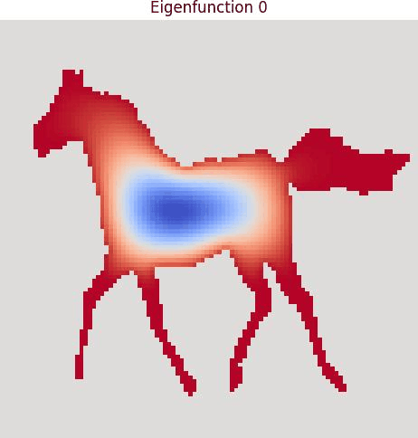

# Experiments with Laplacian operator

This repo aims to play arounf with the Laplacian operator. The idea of making it comes from a [X post](https://x.com/gabrielpeyre/status/1884481605089255549) from Gabriel Peyré.  
For short, the Laplacian is a differential operator which appears in the modelling of many physical phenomena. Here is a list (from ChatGPT) of some of them:
- Heat Diffusion
- Wave Propagation
- Electrostatics
- Quantum Mechanics
- ...

Eventually, this repo will propose some numerical simulations for most of these phenomena, but there's no guarantee.

Before we delve into the mess that is numerical simulation, let's first define the mathematical objects we're going to use:

The general formula of the Laplacian is 

$$\Delta f = \nabla. \overrightarrow{\nabla}f = \sum_{i=1}^n \frac{\partial^2 f}{\partial x_i^2}$$

For $f:\mathbb{R}^n\rightarrow \mathbb{R}$ and $(x_i)_{1\leq i \leq n}$ cartesian coordinates. More details on the general form on [Wikipedia](https://en.wikipedia.org/wiki/Laplace_operator).  
Here we are interested in the discretization of the operator in the 2D case 

$$\boxed{\Delta f(x,y) \approx f(x-1,y) + f(x+1,y) + f(x,y-1) + f(x,y+1) - 4f(x,y)}$$

**Note**: In this formula we assume that the discretization step is 1. It is reasonable since we'll ultimately be working on pixel grids.

## Spectral Decomposition

In many cases, the differential equations we'll be simulating can be efficiently solved using the spectral decomposition of the Laplacian operator. Whenever necessary, we'll explain how this decomposition facilitates the solution of these equations.  
Let's first explain how spectral decomposition works. A key element to keep in mind is that the Laplacian is a Linear operator, mapping a scalar discrete field to another discrete scalar field. It can thus be represented as a matrix.

**Note**: This representation is not to be confused with the discrete Laplacian convolution kernel

$$
L = 
\begin{bmatrix}
  0 & -1 &  0 \\
 -1 &  4 & -1 \\
  0 & -1 &  0
\end{bmatrix}
$$

Since we'll be focusing on exotic domains, we can't simply compute the convolution of $L$ against the whole image. 

TO CONTINUE...

After computing the eigendecomposition of the Laplacian matrix, we get these appealing images.

  
  

